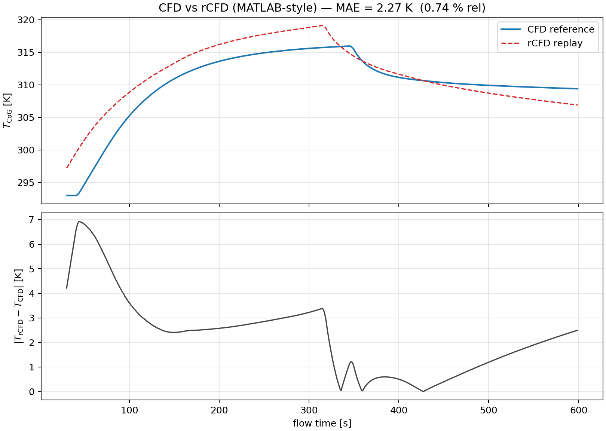
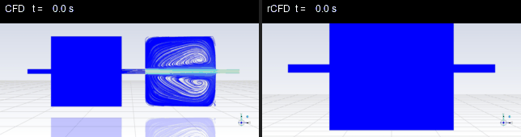

# BuoyantJet-rCFD-AI-Benchmark

> A research-grade benchmark repository for **buoyant jet flow**, comparing a
> high-fidelity **CFD reference simulation** against a validated
> **recurrence-CFD (rCFD) replay**, and providing **AI-ready infrastructure**
> for future Scientific Machine Learning surrogate models.

Master's thesis project — **Step 1: Data-based Numerical Simulation of Buoyant
Jet Flow** — Johannes Kepler University Linz, Institute of Particulate Flow
Modelling.

---

## ⚠️ Honesty statement

This repository documents **completed Step 1 work only**. It contains:

- A validated CFD reference simulation
- A validated rCFD replay simulation
- Quantitative CFD vs. rCFD comparison
- **AI-ready** dataset preparation and benchmark scaffolding

It **does NOT** contain:

- Trained neural-operator weights
- Validated FNO / PINN / ConvLSTM benchmark numbers
- A production AI surrogate

Anything in `ai_baseline/` is **infrastructure and skeletons** for future Step 2
work. Please do not cite this repository as evidence of a working AI
surrogate — that work is planned, not finished.

---

## 1. Project Overview

The repository organizes and reproduces the comparison between two numerical
strategies for an adiabatic buoyant jet in a water-filled tank:

1. **CFD reference** — high-fidelity transient simulation in ANSYS Fluent.
2. **rCFD replay** — recurrence-CFD reduced-order acceleration of the same
   physics.

It also lays the foundation for a future third level: **AI surrogate models**
trained on the CFD/rCFD snapshot dataset.

| Level             | Status                     | Role                                         |
|-------------------|----------------------------|----------------------------------------------|
| CFD reference     | ✅ Validated (Step 1)       | Ground-truth, expensive baseline             |
| rCFD replay       | ✅ Validated (Step 1)       | Physics-based reduced-order acceleration     |
| AI surrogate      | 🛠️ Infrastructure only      | Planned Step 2 — data-driven prediction      |

---

## 2. Research Motivation

Buoyant jets and thermal stratification appear in nuclear safety, building
ventilation, lithium-ion thermal management, and propellant tank conditioning.
Resolving them with full CFD is accurate but slow, which makes design-space
exploration, uncertainty quantification, and digital-twin loops impractical.

This project investigates a two-stage acceleration ladder:

- **rCFD** — physics-based recurrence to compress long thermal transients into
  a reusable database of cell-to-cell shifts, reaching tens of times speed-up
  while staying within engineering accuracy.
- **Scientific ML surrogates** — data-driven models trained on CFD/rCFD
  snapshots, with the goal of pushing speed-up further while preserving
  physical structure.

Step 1 (this repository) delivers the validated CFD/rCFD baseline and the
**AI-ready** dataset needed to honestly evaluate Step 2.

---

## 3. Physical Problem — Adiabatic Buoyant Jet

A heated water jet enters a closed tank initially at uniform temperature.
Buoyancy drives a rising plume that progressively mixes and stratifies the
tank.

| Property                | Value             |
|-------------------------|-------------------|
| Working fluid           | Water             |
| Wall condition          | Adiabatic         |
| Initial tank temperature| 293 K             |
| Jet inlet temperature   | 333 K             |
| Time-step size          | 0.2 s             |
| CFD physical time       | ≈ 658 s           |
| rCFD replay episodes    | 600               |

### Mesh

| Quantity | Value   |
|----------|---------|
| Cells    | 85 625  |
| Nodes    | 94 216  |

The mesh, BCs, and solver setup are inherited from the
`bouyant_jet_replay` rCFD tutorial (ANSYS Fluent + rCFD UDF library) and were
adapted for Windows 11.

---

## 4. CFD Reference Workflow

The CFD reference is the physical ground truth for this benchmark.

Pipeline:

1. **Spin-up** — `CFD_start.scm` runs the tank to a pseudo-steady state and
   exports `CFD_start_energy.out`.
2. **Reference run** — `CFD_run.scm` runs the full transient and writes
   `CFD_temperature.out` plus 630 snapshot images
   (`CFD_T_path_XXXX.jpg`, indices 0000–0629).
3. **Post-processing** — MATLAB scripts compute centre-of-gravity temperature
   evolution and export comparison plots.

Reproducibility details: see [`docs/cfd_setup.md`](docs/cfd_setup.md).

---

## 5. rCFD Replay Workflow

The rCFD workflow records cell-to-cell shifts from a short CFD reference and
then replays the thermal transient cheaply by re-using that recurrence
database.

Pipeline:

1. **`rCFD_prep.scm`** — compile rCFD UDFs, build C2C shifts, recurrence
   matrix, topology and norm fields.
2. **`rCFD_run.scm`** — replay 600 episodes, writing temperature monitors,
   balance file, and 600 snapshot images (`rCFD_BJet_XXXX.jpg`).
3. **Post-processing** — MATLAB scripts produce mean-temperature and
   centre-of-gravity plots aligned with the CFD reference.

Reproducibility details: see [`docs/rcfd_workflow.md`](docs/rcfd_workflow.md).

---

## 6. Windows 11 Adaptation

The upstream rCFD tutorial targets Linux. This project adapted the entire
workflow to a Windows 11 machine running ANSYS Fluent, including UDF
compilation, path conventions, and MATLAB post-processing (`.bat` driver).

See [`docs/windows11_adaptation.md`](docs/windows11_adaptation.md).

---

## 7. Validated Step 1 Results

All numbers below come from the actual Step 1 run. They are reported as-is and
will be re-generated by `scripts/compare_cfd_rcfd.py` when run against the
local dataset.

### Dataset produced

| Quantity                          | Value           |
|-----------------------------------|-----------------|
| CFD snapshots                     | 630             |
| rCFD snapshots                    | 600             |
| Time-step size                    | 0.2 s           |
| CFD physical time                 | ≈ 658 s         |

### rCFD vs. CFD accuracy (mean tank temperature)

| Metric                        | Value      |
|-------------------------------|------------|
| Mean absolute error           | 2.27 K     |
| Max absolute error            | 6.92 K     |
| Mean relative error           | 0.74 %     |
| Max relative error            | 2.36 %     |

### Performance

| Metric                           | Value          |
|----------------------------------|----------------|
| rCFD replay speed-up vs. CFD     | **37.6×**      |

These numbers establish the **physics-based** reduced-order baseline that any
future AI surrogate has to be honestly measured against.

---

## 8. Dataset Structure

```
data/
├── raw/              # Raw monitor/output files from Fluent (.out, .trn)
├── processed/        # Cleaned NumPy / CSV arrays
├── cfd_snapshots/    # 630 CFD snapshot frames (referenced by index)
├── rcfd_snapshots/   # 600 rCFD snapshot frames
├── metadata/         # YAML/JSON describing each run
└── README.md
```

Large `.cas.h5` / `.dat.h5` Fluent files and full snapshot folders are
**git-ignored**. Instructions for placing them locally live in
[`data/README.md`](data/README.md). A tiny demo set lives in
[`sample_data/`](sample_data/).

Full description: [`docs/dataset_description.md`](docs/dataset_description.md).

---

## 9. Benchmark Philosophy

The repository is designed around a three-tier benchmark:

| Tier            | Cost          | Accuracy          | Status         |
|-----------------|---------------|-------------------|----------------|
| CFD reference   | High          | Ground truth      | ✅ Step 1       |
| rCFD replay     | ~37× cheaper  | 2.27 K MAE        | ✅ Step 1       |
| AI surrogate    | TBD           | TBD               | 🛠️ Step 2       |

Future AI models will be evaluated **against rCFD** (the validated reduced
baseline) and **against CFD** (ground truth), using the metrics defined in
`ai_baseline/metrics.py`.

Full design: [`docs/benchmark_design.md`](docs/benchmark_design.md).

---

## 10. AI-Ready Infrastructure

`ai_baseline/` is **infrastructure only** for now:

- `dataset.py` — snapshot loader skeleton (image stacks → arrays).
- `preprocessing.py` — image-to-temperature decoding and normalization
  utilities.
- `metrics.py` — MAE, max-AE, relative error, energy-conservation diagnostic.
- `baseline_pod_regression.py` — POD + linear regression skeleton.
- `baseline_pod_lstm.py` — POD + small LSTM skeleton.
- `baseline_autoencoder.py` — convolutional autoencoder skeleton.
- `train_baseline.py` / `evaluate_baseline.py` — training/eval entry points.

All of these contain `TODO`s where future work has to land. None of them
produces a validated benchmark result yet.

---

## 11. Future Scientific ML Extension

Planned (not implemented):

1. POD-based reduced-order modelling on the CFD snapshot tensor.
2. Latent-space thermal dynamics with LSTM / ConvLSTM.
3. Convolutional autoencoder compression of temperature fields.
4. Fourier Neural Operator surrogate for time-stepping in latent space.
5. Physics-informed losses (energy conservation, boundary respect).
6. Aerospace-oriented surrogate use cases (propellant tank thermal
   conditioning, on-orbit environmental control).

Roadmap: [`docs/scientific_ml_roadmap.md`](docs/scientific_ml_roadmap.md)
and [`docs/future_ai_extension.md`](docs/future_ai_extension.md).

---

## 12. Installation

Tested on Windows 11 with Python 3.10+.

```powershell
git clone <this-repo-url>
cd BuoyantJet-rCFD-AI-Benchmark
python -m venv .venv
.\.venv\Scripts\Activate.ps1
pip install -r requirements.txt
```

ANSYS Fluent and the rCFD UDF library are **external dependencies** —
required only if you want to regenerate the CFD/rCFD datasets from scratch
(see `docs/cfd_setup.md`). To work with the existing snapshot dataset, only
the Python stack is needed.

---

## 13. Usage

Reproduce the validated Step 1 CFD vs. rCFD comparison from the snapshots and
monitor files produced by Fluent:

```powershell
# 1. Sanity-check the dataset
python scripts\check_dataset.py --data-root data\

# 2. Organize/rename raw Fluent outputs into the canonical layout
python scripts\organize_snapshots.py --src "..\bouyant_jet_replay\post" --dst data\

# 3. Plot temperature evolution
python scripts\plot_temperature_series.py --data-root data\ --out assets\figures\

# 4. Quantitative CFD vs. rCFD comparison
python scripts\compare_cfd_rcfd.py --data-root data\ --out assets\figures\

# 5. Build animations
python scripts\make_animation.py --src data\cfd_snapshots  --out assets\animations\cfd.gif
python scripts\make_animation.py --src data\rcfd_snapshots --out assets\animations\rcfd.gif
python scripts\make_comparison_animation.py --data-root data\ --out assets\animations\cfd_vs_rcfd.gif --stride 10 --fps 12 --target-width 420

# 6. Prepare AI-ready tensors
python scripts\prepare_ai_dataset.py --data-root data\ --out data\processed\
python scripts\export_numpy_arrays.py --data-root data\ --out data\processed\
```

---

## 14. Visualization Examples

CFD vs. rCFD temperature evolution, MATLAB-style alignment
(MAE = 2.27 K, 0.74 % rel):



Side-by-side comparison animation
(`assets/animations/cfd_vs_rcfd_preview.gif`, ~0.7 MB; full-resolution
versions in the same folder are git-ignored):



The post-processing pipeline (see `assets/figures/`) reproduces:

- CFD vs. rCFD overlay on `T_CoG(t)`
- Absolute error evolution
- Snapshot grids at matched indices

Animations of the full transient are exported to `assets/animations/`:
the small `cfd_vs_rcfd_preview.gif` is tracked in git; the larger
`cfd.gif`, `rcfd.gif`, and `cfd_vs_rcfd.gif` are regenerated locally
via `scripts/make_animation.py` and `scripts/make_comparison_animation.py`.

---

## 15. Roadmap

- [x] Step 1 — Validated CFD reference + rCFD replay
- [x] Step 1 — CFD vs. rCFD quantitative comparison
- [x] Step 1 — AI-ready dataset structure
- [ ] Step 2 — POD + regression baseline
- [ ] Step 2 — POD + LSTM latent-time-stepper
- [ ] Step 2 — Convolutional autoencoder for field compression
- [ ] Step 2 — ConvLSTM / FNO surrogate
- [ ] Step 2 — Physics-informed loss terms
- [ ] Step 3 — Aerospace surrogate transfer case

---

## 16. Citation

If you use this repository, please cite the underlying thesis work:

```bibtex
@mastersthesis{zainun_buoyantjet_2026,
  author = {Mochamad Bukhori Zainun},
  title  = {Data-based Numerical Simulation of Buoyant Jet Flow},
  school = {Johannes Kepler University Linz},
  year   = {2026},
  note   = {Step 1 — CFD/rCFD benchmark and AI-ready dataset.
            \url{https://github.com/<user>/BuoyantJet-rCFD-AI-Benchmark}}
}
```

---

## 17. Acknowledgements

- Prof. Stefan Pirker — supervisor, JKU Linz.
- Institute of Particulate Flow Modelling (PFM), JKU Linz —
  rCFD framework and `bouyant_jet_replay` tutorial.
- ANSYS Fluent — CFD solver.

---

## License

This repository is distributed under the
[GNU General Public License v3.0](LICENSE), matching the upstream rCFD code.
